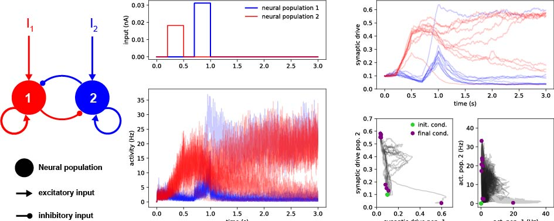

# Semi-supervised Deep Learning strategy for image classication
Semi-supervised learning approaches provide ways to leverage on unlabelled samples to improve task performance for labelled examples. Here, we implemented two Deep Learning strategies to solve a 1k-label image classification task. Our first approach consists of a convolutional neural network with ResNet stacked on top of the encoding moduleof a convolutional auto-encoder (CAE). Our second model is a modification of the [Mean Teacher algorithm](https://papers.nips.cc/paper/6719-mean-teachers-are-better-role-models-weight-averaged-consistency-targets-improve-semi-supervised-deep-learning-results.pdf). Including unlabelled data using these strategies provided superior classication generalization. Our results were awarded the 3rd place winner Semi-supervised learning competition (2019). 

In collaboration with [Maple Li](https://github.com/Millebean) and Wang ChiaoHsun. [Python/PyTorch code](https://github.com/pedroherrerovidal/Semi-supervised_Learning_DL)

# Models in Computational Neuroscience
This project compiles  a collection of methods in computational neuroscience to describe properies of neurons and neural networks with empashis in dynamics and Recurrent Neural Networks (RNNs). Each models is implemented from scratch and disected in a series of self-explanatory [Jupyter Notebooks](https://github.com/pedroherrerovidal/ComputationalNeuroscience). 

