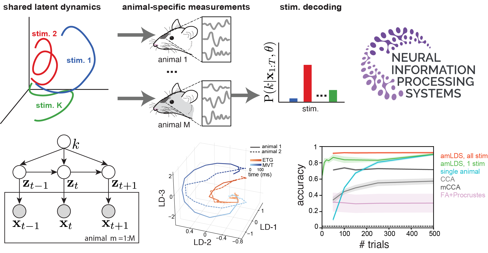
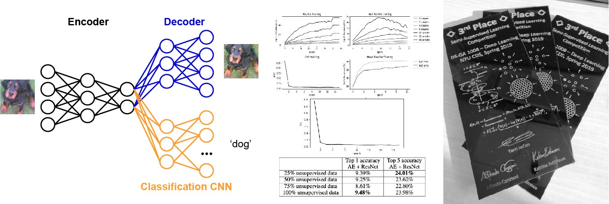
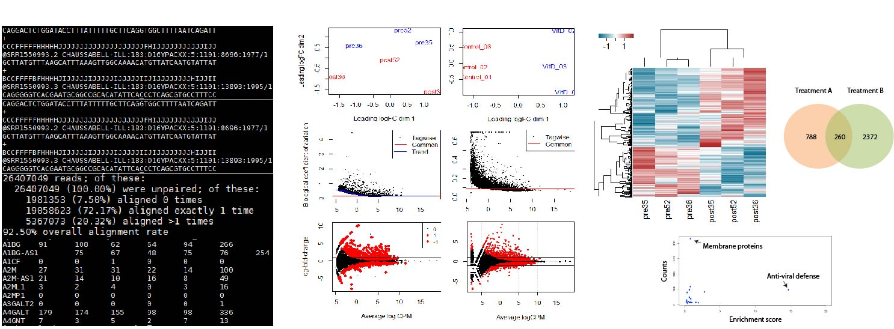

# Across-animal odor decoding by probabilistic manifold alignment 
Identifying the common structure of neural dynamics across subjects is key for extracting unifying principles of brain computation and for many brain machine interface applications. Here, we propose a novel probabilistic approach for aligning stimulus-evoked responses from multiple animals in a common low dimensional manifold and use hierarchical inference to identify which stimulus drives neural activity in any given trial. Our probabilistic decoder is robust to a range of features of the neural responses and significantly outperforms existing neural alignment procedures. When applied to recordings from the mouse olfactory bulb, our approach reveals low-dimensional population dynamics that are odor specific and have consistent structure across animals. Thus, our decoder can be used for increasing the robustness and scalability of neural-based chemical detection. 

This work is published at NeurIPS 2021 as a spotlight (<3% acceptance). [Python code](https://github.com/pedroherrerovidal/amLDS)

# Semi-supervised Deep Learning strategy for image classication
Semi-supervised learning approaches provide ways to leverage on unlabeled samples to improve task performance for labeled examples. Here, we implemented two Deep Learning strategies to solve a 1k-label image classification task. Our first approach consists of a convolutional neural network with ResNet stacked on top of the encoding module of a convolutional auto-encoder (CAE). Our second model is a modification of the [Mean Teacher algorithm](https://papers.nips.cc/paper/6719-mean-teachers-are-better-role-models-weight-averaged-consistency-targets-improve-semi-supervised-deep-learning-results.pdf). Including unlabeled data using these strategies provided superior classication generalization. Our results were awarded the 3rd place winner Semi-supervised learning competition (2019). 

In collaboration with [Maple Li](https://github.com/Millebean) and ChiaoHsun Wang. [Python/PyTorch code](https://github.com/pedroherrerovidal/Semi-supervised_Learning_DL)

# Models in Computational Neuroscience
This project compiles  a collection of methods in computational neuroscience to describe properies of neurons and neural networks with empashis in dynamics and Recurrent Neural Networks (RNNs). Each models is implemented from scratch and disected in a series of self-explanatory [Jupyter Notebooks](https://github.com/pedroherrerovidal/ComputationalNeuroscience). 

# Sequencing data processing, analysis and visualization for biomedical research
This project developed a preprocessing and analysis pipeline to extract biomedically relevant information from transcriptomics data, and specifically applied it to the study of Multiple Sclerosis treatments. Here, we started from raw nucleotide sequences, preprocess and curate them to extract tables of counts linking gene expression and physiological condition. Then we extracted significantily modulated genes for across conditions, correcting for multiple data comparisons, did unsupervised exploration of data structure using multidimensional scaling (MDS) and draw predictions between treatment conditions using generalized linear models (GLMs). Results from this project identified gene regulation and membrane protein as potential targets for multiple sclerosis treatment. 

In collaboration with [Gunjan Gala](https://github.com/gunjangala). [R and Shell code](https://github.com/pedroherrerovidal/GeneTranscriptomicDataAnalysis)

